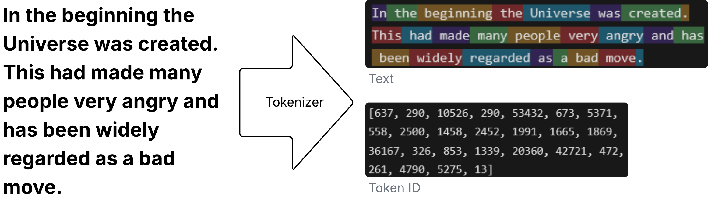
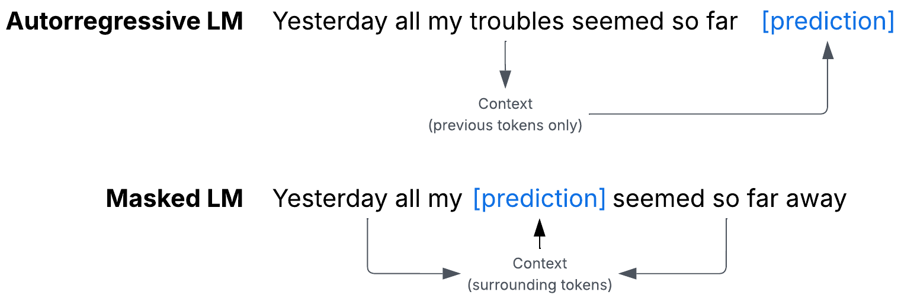
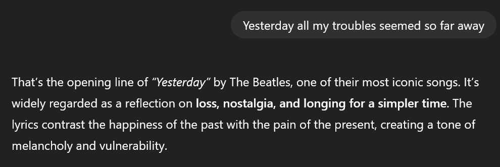
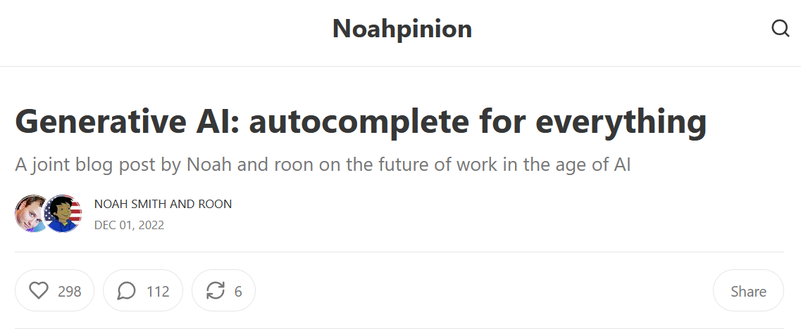
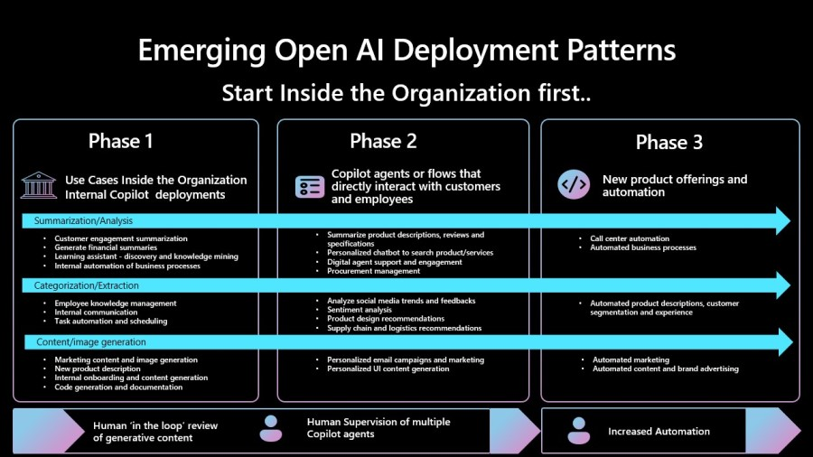

<style>
img[alt~="center"] {
  display: block;
  margin: 0 auto;
}
</style>

# Deploying AI 
## Introduction to AI Systems

```code
$ echo "Data Science Institute"
```
---

# Introduction

---

# Agenda

---

## Agenda

+ What is an AI System?
+ Use cases and planning an AI application
+ The AI engineering Stack

---

## AI Engineering

We will be covering Chapter 1 of AI Engineering, by Chip Huyen.


---

## Main Points

---


# What is an AI System?


---

## What is an AI System?

+ Foundation models
    - Language models
    - Self-supervision
    - From language models to foundation models
+ From foundation models to AI engineering

---

## What is an AI System?

+ It is a system based on a large-scale machine learning model.
+ Many principles of productionizing AI applications are similar to those applied in machine learning engineering.
+ However, the availability of large-scale, readily available models affords new possibilities, and also carries risks and challenges.

---

## What Makes AI Different? 

+ AI is different because of scale.
+ Large Language Models (LLMs) and other Foundation Models (FMs) follow a maximalist approach to creating models: more complex models are trained on more data as more compute and storage become available.
+ FMs are becoming capable of more tasks and therefore they are deployed in more applications and more teams leverage their capabilities. 
+ FMs make it cheaper to develop AI applications and reduce time to market.
+ FMs require more data, compute resources, and specialized talent.

---


---


---

## What Makes AI Engineering Different? 

+ FMs are costly to create, develop, deploy, and maintain. Only a few organizations have the capabilities to do so and typical applications are built upon Models-as-a-Service.
+ AI Engineering is the process of building applications on top of readily available models.

---

## Language Models

+ FMs emerged from LLMs which developed from language models.
+ Language models are not new, but have recently developed greatly through *self-supervision*.
+ A language model encodes statistical information about one or more languages. Intuitively, we can use this information to know how likely a word is to appear in a given context.


---

## Tokenization

+ The basic unit of a language model is a token.
+ Tokens can be a character, a word, or a part of a word, depending on the model.
+ Tokenization: the process of converting text to tokens.
+ The set of all tokens is called *vocabulary*.




---

## Why use tokens?

1. Tokens allow the model to break words into meaningful components: "walking" can be broken into "walk" and "ing" 
2. There are fewer unique tokens than unique words, therefore the vocabulary size is reduced
3. Tokens help the model process unknown words: "chatgpting" can be broken down to "chatgpt" and "ing"

---

## Types of Language Models


There are two types of Language Models (LM): Autorregressive LM and Masked LM.



---
## Masked Language Models

+ Masked language model: predicts missing tokens anywhere in a sequence using only the preceding tokens.
+ Commonly used for non-generative tasks such as steniment analysis, text classification, and tasks that require an understanding of the general context (before and after the prediction), such as code debugging.
+ Example, BERT ([Devlin et al., 2018](https://arxiv.org/abs/1810.04805)).


---

## Autorregressive Language Models

+ Autorregressive language model: trained to predict the next token in a sequence.
+ Autorregressive LMs can continually generate one token after another and are the models of choice for text generation.


---

## Completion is a Powerful Task

+ The outputs of language models are open-ended. 
+ Generative model: A model that can generate open-ended outputs.
+ An LM is a completion machine: given a text (prompt), it tries to complete the text.



+ Completions are predictions, based on probabilities, and not guaranteed to be correct.

---

## Completion Tasks

Many tasks can be thought as completion: translation, summarization, coding, and solving math problems. 


> What’s common to all of these visions is something we call the “sandwich” workflow. This is a three-step process. First, a human has a creative impulse, and gives the AI a prompt. The AI then generates a menu of options. The human then chooses an option, edits it, and adds any touches they like. ([Smith, 2020](https://www.noahpinion.blog/p/generative-ai-autocomplete-for-everything)).





---

## Self-Supervision

+ Why language models and not object detection, topic modelling, recommender systems, or any other machine learning task?
+ Any machine learning model requires supervision: the process of training a machine learning model using labelled data.
+ Supervision requires data labelling, and data labelling is expensive and time-consuming.
+ Self-supervision: each input sequence provides both the labels and the contexts the model can use to predict these lables.
+ Because text sequences are everywhere, massive training data sets can be constructed, allowing language models to become LLMs.

---

## Self-Supervision: an example

Input | Output (next token)
------|--------------------
<BOS> | I
<BOS>, I|love
<BOS>, I, love|street
<BOS>, I, love, street|food
<BOS>, I, love, street, food|.
<BOS>, I, love, street, food, . | <EOS>

---

## From LLM to Foundation Models

+ Foundation models: important models which serve as a basis for other applications.
+ Multi-modal model: a model that can work with more than one data modality (text, images, videos, protein structures, and so on.)
+ Self-supervision works for fourndation models, too. For example, labeled images found on the internet.
+ Foundation models transition from task-specific to general-purpose models.


---


# Foundation model use cases

- Coding
- Image and Video Production
- Writing
- Education
- Conversational Bots
- Information Aggregation
- Data Organization
- Workflow Automation

---

# Planning an AI Application

---

## Planning an AI application

- Use Case Evaluation
- Setting Expectations
- Milestone Planning
- Maintenance

---

# Evaluating Use Cases

---

## Why are we doing this?

+ If you do not do this, competitors with AI can make you obsolete.

  - Common for business involving information processing and aggregation.
  - Financial analysis, insurance, and data processing.

+ If you do not do this, you will miss opportunities to boost profits and productivity.

+ You are unsure where AI will fit into your business yet, but you don't want to be left behind.

---

## The Role of AI in the Application (1/3)

**Critical or complementary**

- If an app can work without AI, AI is complementary to the app.
- The more critical AI is to the app, the more accurate and reliable the AI must be.
- Example: Face ID would not work without AI-powered facial recognition, but Gmail would work without Smart Compose.


---

## The Role of AI in the Application (2/3)

**Reactive or Proactive**

  - Reactive features show their responses to users' requests or actions.
  - Proactive features show responses when there is an opportunity.
  - Reactive features are many times expected to happen fast (low latency), proactive responses can be precomputed and shown opportunistically (latency is not as important).


---

## The Role of AI in the Application (3/3)

**Dynamic or Static**

- Dynamic features are updated continually with user feedback.
- Static features are updated periodically.
- Example: Face ID needs updating as people change appearance.

---

# The Role of Humans in the Application

- Will AI provide background support to humans, make decisions directly, or both?
- Modes of interaction:

  - AI shows several responses that human agents can reference to write faster responses.
  - AI responds only to simple requests and routes more complex requests to humans.
  - AI responds to al requests directly, without human involvement.

- Involving humans in AI's decision-making process is called human-in-the-loop.

---

# The Crawl-Walk-Run Model

[Microsoft (2023)](https://www.microsoft.com/en-us/industry/blog/retail/2023/10/23/from-discussion-to-deployment-4-key-lessons-in-generative-ai/) proposed a framework for adoption of AI automation in products:

1. Crawl: human involvement is mandatory.
2. Walk: AI can directly interact with internal users.
3. Run: increased automation, potentially interact with external users.


---


AI Deployment Strategies ([Guy, 2023](https://www.microsoft.com/en-us/industry/blog/retail/2023/10/23/from-discussion-to-deployment-4-key-lessons-in-generative-ai/))

---

## AI Product Defensibility

+ Low barrier to entry is both a blessing and a curse.
   - An AI product is a layer between the foundation model and the user. 
   - If the foundation model expands its capabilities, the intermediate layer may no longer be needed. 
+ Three types of competitive advantages: technology, data, and distribution. 

  - Technology and distribution can be easily achieved by large organizations.
  - Data competitive advantages are more naunced: large organizations can have large current data sets, but may lack data on emerging activities.

---

## Setting Expectations

To ensure a product is not put in front of users before it is ready:

- Quality metrics to measure the quality of the chatbot's responses.
- Latency metrics including TTFT (Time To First Token), TPOT (time per output token), and total latency.
- Cost metrics: how much it costs per inference request.
- Other metrics: interpretability and fairness.

---

## Milestone Planning

- The stronger off-the shelf models, the less work you will have to do.
- Planning an AI product must account for the last mile challenge: 
  
  + Initial success with foundation models can be misleading. 
  + The effort required to build a product after the initial demo can be significant.


---

## Maintainance

+ Think about how the product will change over time.
+ Added challenge of rapid progress of AI itself.
+ Constantly evaluate the cost/benefit of each technology investment.
+ Technologies surrounding AI are considered national security issues for many countries, meaning resources for AI can be regulated: compute, talent, and data.


---

# The AI engineering Stack


---

## The AI engineering Stack

+ Three layers of the AI Stack
+ AI Engineering vs ML Enginering
+ AI Enginnering vs Full-Stack Engineering

---

## Three Layers of the AI Stack

---

---

---


# References

---

## References

- Devlin, Jacob, Ming-Wei Chang, Kenton Lee, and Kristina Toutanova. "Bert: Pre-training of deep bidirectional transformers for language understanding." In Proceedings of the 2019 conference of the North American chapter of the association for computational linguistics: human language technologies, volume 1 (long and short papers), pp. 4171-4186. 2019.
- Guy, Oliver. From discussion to deployment: 4 key lessons in generative AI. Microsoft Blog, October 23, 2023 ([URL](https://www.microsoft.com/en-us/industry/blog/retail/2023/10/23/from-discussion-to-deployment-4-key-lessons-in-generative-ai/)).
- Huyen, Chip. Designing machine learning systems. O'Reilly Media, Inc., 2022 
- Smith, Noah and Roon. Generative AI: autocomplete for everything. Dec. 1, 2022 ([URL](https://www.noahpinion.blog/p/generative-ai-autocomplete-for-everything))