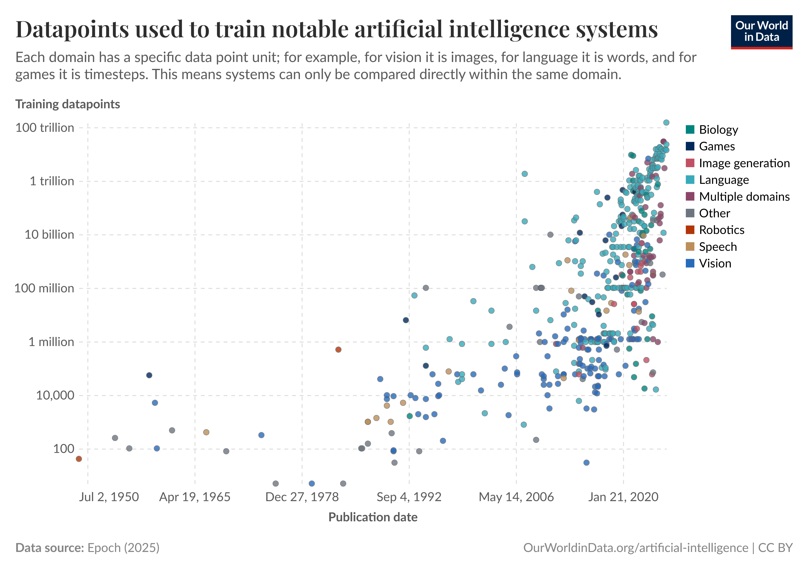

# Deploying AI 
## Introduction to AI Systems

```code
$ echo "Data Science Institute"
```
---

# Introduction

---

# Agenda

---

## Agenda

+ What is an AI System?
+ Use cases and planning an AI application
+ The AI engineering Stack

---

## Main Points

---


# What is an AI System?


---

## What is an AI System?

+ Foundation models
    - Language models
    - Self-supervision
    - From language models to foundation models
+ From foundation models to AI engineering

---

## What Makes AI Different? 

+ AI is different because of scale
+ Large Language Models (LLMs) and other Foundation Models (FMs) follow a maximalist approach to creating models: more complex models are trained on more data as more compute and storage become available
+ FMs are becoming capable of more tasks and therefore they are deployed in more applications and more teams leverage their capabilities
+ FMs require more data, compute resources, and specialized talent
+ FMs are delivered as Model-as-a-Service

---


---



---

# Foundation model use cases

- Coding
- Image and Video Production
- Writing
- Education
- Conversational Bots
- Information Aggregation
- Data Organization
- Workflow Automation

---

## Planning an AI application

- Use Case Evaluation
- Setting Expectations
- Milestone Planning
- Maintenance

---

# The AI engineering Stack

+ Three layers of the AI Stacak
+ AI Engineering vs ML Enginering
+ AI Enginnering vs Full-Stack Engineering

---

# References

---

## References

- Huyen, Chip. Designing machine learning systems. O'Reilly Media, Inc., 2022 