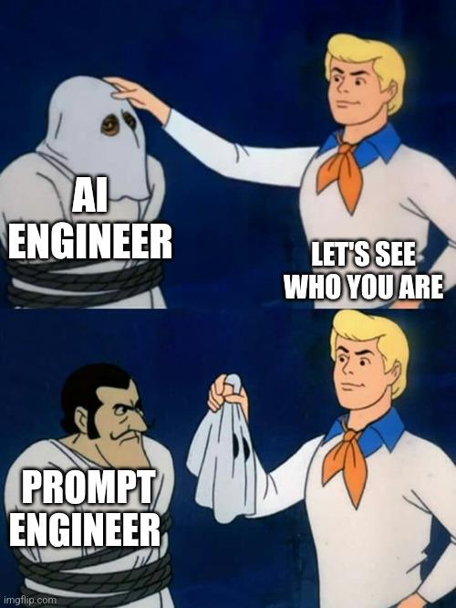
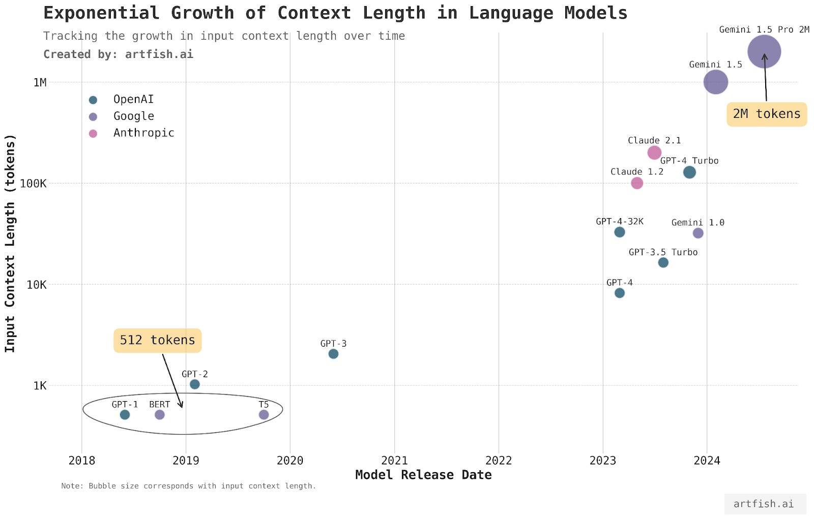
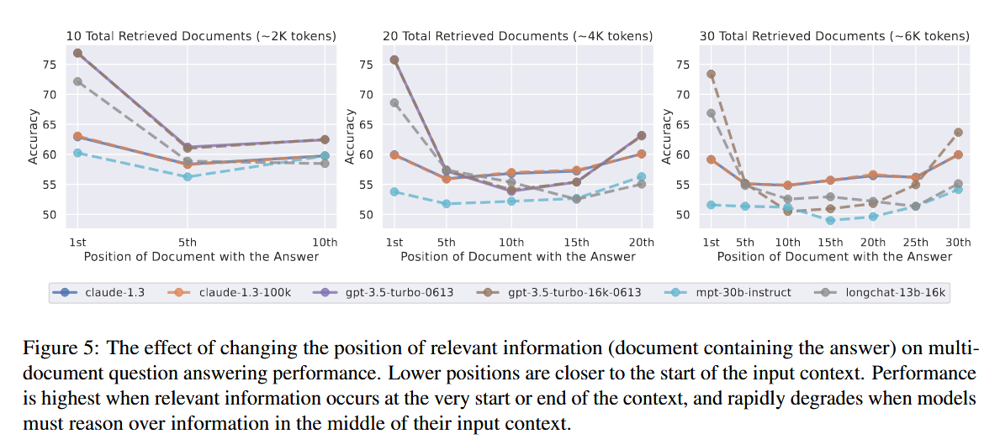
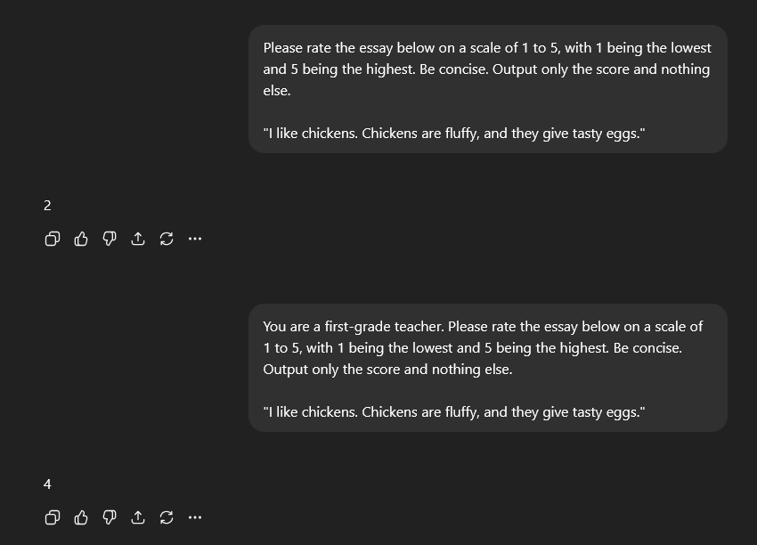

<style>
img[alt~="center"] {
  display: block;
  margin: 0 auto;
}
</style>

# Deploying AI 
## Prompt Engineering

```code
$ echo "Data Science Institute"
```
---

# Introduction

---

# Agenda

---

## Agenda

+ System vs user prompt, context length and context efficiency
+ Prompt engineering best practices
+ Defensive prompt engineering

---

## Reference Process Flow


<center>(Bommasani et al, 2025)</center>

---

## What is Prompt Engineering?

- Prompt engineering is the process of crafting instructions that guide a model to generate the desired outcome.  
- It is the easiest and most common model adaptation technique.  
- Unlike finetuning, it does not change the model’s weights but instead steers its behavior.  
- Strong foundation models can often be adapted using prompt engineering alone.
- It is easy to write prompts, but not easy to write effective prompts.

---

## Misconceptions and Criticisms

- Some dismiss prompt engineering as unscientific fiddling with words.  
- In reality, it involves systematic experimentation and evaluation.  
- It should be treated with the same rigor as any machine learning experiment.  
- Effective prompt engineering requires communication skills and technical knowledge.



---

## The Role of Prompt Engineering

- Prompt engineering is a valuable skill but not sufficient alone for production systems.
- Developers also need skills in statistics, engineering, and dataset curation.
- Well-designed prompts can power real applications but require careful defense against attacks.

---

# Introduction to Prompting

---

## Anatomy of a Prompt

- A prompt is an instruction given to a model to perform a task.  
- Prompts may include task descriptions, examples, and the specific task to perform.  

```
Given a text, extract all entities. Output only the list of extracted entities, separated by commas, and nothing else.

Text: "Brave New World is a dystopian novel written by Aldous Huxley, first published in 1932."
Entities: Brave New World, Aldous Huxley

Text: ${TEXT_TO_EXTRACT_ENTITIES_FROM}
Entities:
```

+ For prompting to work, the model must be able to follow instructions. 
+ How much prompt engineering is needed depnds on how robust the model is to prompt perturbations.

---

## Measuring Robustness

- Robustness can be tested by slightly altering prompts and observing results.  
- Stronger models are more robust and understand equivalent expressions such as “5” and “five.”  
- Working with stronger models often reduces prompt fiddling and errors.

---

# In-Context Learning

---

## Zero-Shot and Few-Shot Learning

- Teaching models via prompts is known as in-context learning.  
- Zero-shot learning uses no examples in the prompt.  
- Few-shot learning uses a small number of examples to guide the model.  
- The effectiveness depends on the model and the task.
- GPT-3 demonstrated that it was able to learn examples contained in the prompt, even if the desirable behaviour is different from the behaviour that the model was trained on.

---

## Benefits of In-Context Learning

- Models can adapt to new information beyond their training cut-off date.  
- In-context learning acts like continual learning by incorporating new data at inference time.  
- This prevents models from becoming outdated.

---

# Prompt Structure

---

## System Prompts and User Prompts

- Many APIs separate prompts into system prompts and user prompts.  
  - The system prompt defines rules, roles, and tone.  
  - The user prompt contains the specific task or query.  
- The final input is a combination of both.


```
System prompt: 
You are an experienced real estate agent. Your job is to read each 
disclosure carefully, fairly assess the condition of the property 
based on this disclosure, and help your buyer understand the risks 
and opportunities of each property. For each question, answer 
succinctly and professionally.

User prompt:
Context: [disclosure.pdf]
Question: Summarize the noise complaints, if any, about this property.
Answer:
```

---

## Importance of Templates

- Models such as Llama require specific chat templates.  
- Deviations from templates can cause degraded performance.  
- Using incorrect templates is a common source of silent failures.
- For example, Llama 3 prompts need to follow a specific [prompt template](https://github.com/meta-llama/llama3?tab=readme-ov-file#instruction-tuned-models). For example:
- When implementing or fine-tuning a model with a given template, it is important to maintain the template's integrity.

---

## Example of a Chat Template

```
<s> [INST] <<SYS>>
You are a friendly chatbot who always responds in the style of a pirate
<</SYS>>

How many helicopters can a human eat in one sitting? [/INST] 

Ahoy there, mate! A human can't eat a helicopter in one sitting, no matter 
how much they might want to. They're made of metal and have blades that spin 
at high speeds, not exactly something you'd want to put in your belly!</s>  

<s> [INST] Are you sure?</s>  [/INST] 

Aye, I'm sure! Helicopters are designed for flight and are not meant to be 
consumed by humans. They're made of metal and have blades that spin at high 
speeds, which would be very dangerous to ingest. So, no human can eat a 
helicopter in one sitting, no matter how much they might want to.</s>
```

---

# Context Length

---

## Expanding Context Windows

- Context length determines how much information a model can process in one prompt.  
- Context windows have grown from 1K tokens in GPT-2 to 2M tokens in Gemini-1.5.  
- Larger context allows models to handle long documents and complex tasks.
- Image: [(Yun, 2024)](https://www.artfish.ai/p/long-context-llms)



---

## Context Efficiency

- Models understand information at the beginning and end of prompts better than in the middle.  
- Needle-in-a-haystack tests show models often miss details buried deep in the prompt.  
- Developers should place important information strategically.

---

## Needle in the Haystack

Needle in the Haystack (NIAH): insert a random piece of information (needle) in different locations of the prompt (haystack) and ask a model to find it.


<center> (Liu et al, 2023)</center>

---

# Best Practices in Prompt Engineering

---

## Writing Clear Instructions

- Clear and explicit instructions reduce ambiguity.
  + Explain what you want the model to do: "score between 1 and 5..."
  + Adjust prompts to reduce unwanted behaviour: if the model outputs 4.5, update the prompt to output integers.
- Specify scoring systems, rubrics, required formats, or acceptable ranges.  
- Include examples to clarify expected responses.

---

## Using Personas

- Assigning a persona helps models respond appropriately.
- For example, scoring essays as a first-grade teacher yields different results than as a professional editor.

---

## Scoring an Essay with DIfferent Personas



---

## Providing Examples

- Examples guide the model toward the desired output style.  
- Few tokens should be used to conserve context space and reduce costs.

---

## Specifying Output Format

- Structured tasks require explicit instructions about output format.  
- Models should be told to produce JSON, integers, or labeled text.  
- Using markers prevents confusion between inputs and outputs.

---

## Providing Sufficient Context

- Including reference texts improves accuracy and reduces hallucinations.  
- Context can be supplied directly or retrieved through tools like RAG pipelines.

---

# Breaking Down Tasks

---

## Decomposing Tasks

- Complex tasks should be broken into smaller subtasks.  
- Each subtask can have its own prompt.  
- Subtask chaining improves performance and reliability.

---

## Benefits of Decomposition

- Monitoring intermediate results becomes easier.  
- Debugging faulty steps is more manageable.  
- Some steps can be parallelized to save time.  
- Overall reliability improves even if costs increase slightly.

---

# Giving Models Time to Think

---

## Chain-of-Thought Prompting

- Chain-of-thought prompting asks models to reason step by step.  
- It significantly improves reasoning and reduces hallucinations.  
- Variants include “think step by step” or “explain your decision”.

---

## Self-Critique Prompting

- Models can be instructed to review and critique their own outputs.  
- This helps identify errors and improve reliability.  
- However, it increases latency and costs.

---

# Iterating and Tools

---

## Iterating on Prompts

- Prompt engineering requires trial and error.  
- Each model has quirks that must be discovered experimentally.  
- Prompts should be versioned, tracked, and systematically tested.

---

## Prompt Engineering Tools

- Tools like DSPy and PromptBreeder automate prompt optimization.  
- AI models themselves can generate and refine prompts.  
- Automated tools must be monitored to avoid runaway costs.

---

# Organizing Prompts

---

## Versioning Prompts

- Prompts should be separated from code for readability and reuse.  
- They can be organized into catalogs with metadata.  
- Prompt catalogs allow versioning and tracking dependencies.

---

# Defensive Prompt Engineering

---

## Prompt Attacks

- Models are vulnerable to prompt extraction, jailbreaking, and information extraction.  
- Attackers can exploit weaknesses to cause data leaks, misinformation, or brand damage.

---

## Reverse Prompt Engineering

- Attackers attempt to reconstruct system prompts by tricking models.  
- Extracted prompts may be hallucinated, making verification difficult.  
- Proprietary prompts can be liabilities if not secured.

---

## Jailbreaking and Prompt Injection

- Jailbreaking subverts safety mechanisms.  
- Prompt injection adds malicious instructions to legitimate queries.  
- Both can cause unauthorized actions, misinformation, or harmful outputs.

---

## Information Extraction

- Attackers can extract private data or copyrighted content from models.  
- Training data leakage is possible through crafted prompts.  
- Larger models are more vulnerable due to memorization.

---

## Defensive Measures

- Prompts can explicitly forbid certain outputs.  
- System-level defenses include sandboxing, human approvals, and topic filtering.  
- Guardrails on inputs and outputs help detect and block unsafe content.

---

# Chapter Summary

---

## Key Takeaways

- Prompt engineering is powerful but requires rigor and systematic evaluation.  
- Effective prompts need clarity, examples, context, and careful structuring.  
- Task decomposition, chain-of-thought, and iteration improve reliability.  
- Tools and catalogs help scale prompt engineering but must be managed carefully.  
- Defensive strategies are essential to protect against prompt attacks and misuse.

---


# References

---

## References

- Huyen, Chip. Designing machine learning systems. O'Reilly Media, Inc., 2022 
- Liu, Nelson F. et al. "Lost in the middle: How language models use long contexts." [arXiv:2307.03172](https://arxiv.org/abs/2307.03172) (2023).
- Yun, Yennie. Evaluating long context large language models. [artfish.ai](https://www.artfish.ai/p/long-context-llms)
